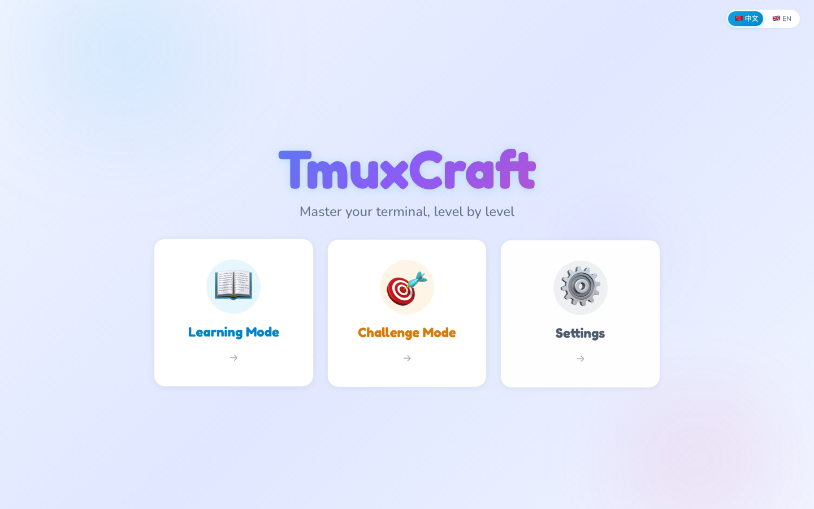
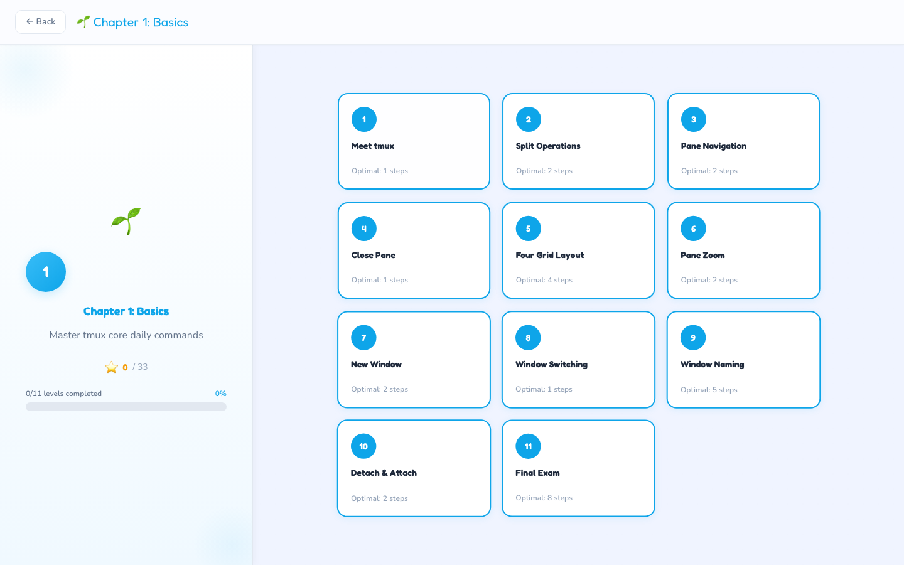
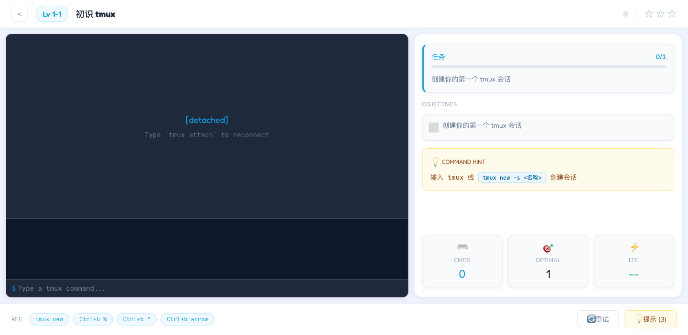

# TmuxCraft

**Master your terminal, level by level.**

TmuxCraft is a browser-based interactive game for learning tmux. Complete levels by executing real tmux commands in a simulated terminal — no actual terminal required.

> tmux 是 AI 时代开发者的「指挥中心」。无论是用 Claude Code Agent Teams 多 Agent 并行开发，还是日常分屏多任务，tmux 都是终端效率的基石。TmuxCraft 帮你在浏览器里轻松掌握它。

## Demo

<table>
  <tr>
    <td></td>
    <td></td>
    <td></td>
  </tr>
  <tr>
    <td align="center">Home</td>
    <td align="center">Level Select</td>
    <td align="center">Gameplay</td>
  </tr>
</table>

## Features

- **26 levels** across 3 chapters — Basics, Advanced, Mastery
- **Real command parsing** — CLI (`tmux split-window -v`), colon (`:split-window`), and prefix keys (`Ctrl+b "`)
- **Full tmux engine** — Session / Window / Pane hierarchy with binary tree layouts, resize, swap, zoom
- **Typo correction** — Levenshtein-based suggestions when you mistype a command
- **Challenge mode** — Timed procedural objectives with leaderboard
- **3-star scoring** — Completion, efficiency (near-optimal steps), no-hint bonus
- **Bilingual** — Chinese / English (i18n)
- **Built-in reference** — tmux cheatsheet accessible anytime

## Quick Start

```bash
git clone https://github.com/codedev-xy/tmuxcraft.git
cd tmuxcraft
npm install
npm run dev
```

Open http://localhost:5173 in your browser.

## Scripts

| Command | Description |
|---|---|
| `npm run dev` | Start dev server with HMR |
| `npm run build` | Type-check and build for production |
| `npm run lint` | Run ESLint |
| `npm run preview` | Preview production build |
| `npx vitest run` | Run all tests (159 tests) |

## Architecture

```
src/
├── core/           # Framework-agnostic tmux simulation engine
│   ├── tmux-engine.ts      # State machine (Session → Window → Pane)
│   ├── command-parser.ts   # CLI / colon / prefix key parsing
│   ├── layout-engine.ts    # Binary tree pane layout system
│   └── keybinding-handler.ts  # Prefix key state machine
├── game/           # Level definitions and game mechanics
│   ├── levels/             # 26 levels across 3 chapters
│   ├── challenge/          # Procedural challenge generator
│   ├── validator.ts        # Objective checking
│   └── scoring.ts          # 3-star scoring system
├── components/     # React UI components
├── store/          # Zustand stores (game, progress, user)
├── hooks/          # useTmuxEngine, useKeyCapture
├── i18n/           # zh.json + en.json
└── styles/         # Tailwind v4 theme
```

### How It Works

```
User Input → CommandParser → ParsedCommand → TmuxEngine → State Update → React Re-render → Validator
```

The core engine is framework-agnostic: `CommandParser` parses input into a `ParsedCommand`, `TmuxEngine` executes it against the state tree, and the `LayoutEngine` recomputes the binary tree layout. React simply renders the result and checks objectives.

## Tech Stack

- **React 19** + TypeScript
- **Vite 7** — dev server & build
- **Tailwind CSS v4** — CSS-based theme configuration
- **Zustand** — state management (game session + persisted progress)
- **Framer Motion** — animations
- **react-i18next** — internationalization
- **Vitest** — testing

## Contributing

Contributions are welcome! Some areas that could use help:

- **New levels** — See `src/game/levels/` for examples. Each level defines initial state, objectives with validators, and hint keys.
- **More commands** — The engine supports 30+ commands; there's always room for more.
- **UI polish** — Component tests, accessibility improvements, mobile responsiveness.

## License

MIT
